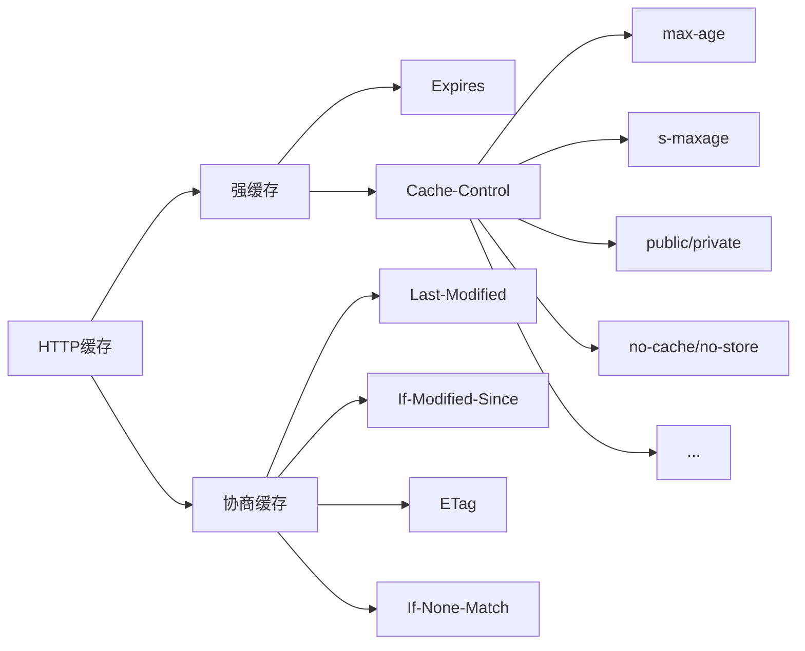
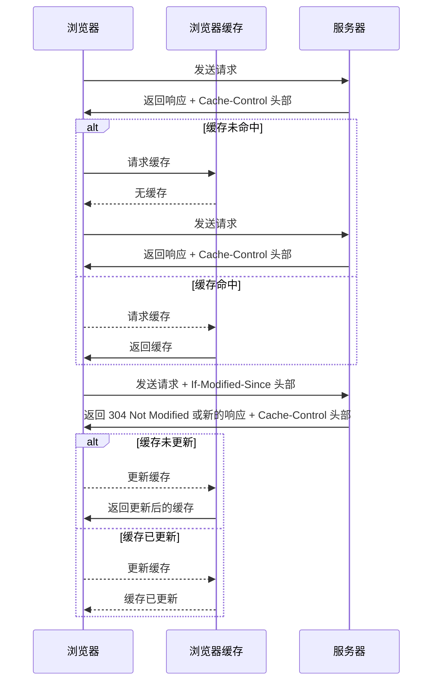

## 前言

缓存的合理使用可**提升网页性能**。

### 什么是缓存（cache）？

缓存是计算机系统中的一种技术，用于临时存储经常访问的数据，以加快数据访问速度。缓存通常位于数据访问路径的中间，可以在数据访问时快速提供数据，而无需每次都从原始数据源获取数据。缓存可以是硬件或软件实现的，可以在多个层次上实现，例如浏览器缓存、操作系统缓存、CPU 缓存等。缓存的使用可以显著提高系统性能，减少对原始数据源的访问次数，从而减少系统资源的占用和延迟。

可以看出，缓存的重点在于**访问速度快、性能高**。

<!-- more -->

### 什么是前端缓存？

**前端缓存**可以直接看作是 **HTTP 缓存**和**浏览器缓存**的结合，两者相辅相成。

**HTTP 缓存**：客户端与服务器之间通信产生的一种缓存，用其以提升服务器资源的重复利用率（有效时间内不向服务器请求相同资源，减少服务器压力）；

**浏览器缓存**：浏览器提供的一种缓存机制，可以将服务器资源和网页访问产生的临时数据缓存到内存或本地，提升客户端的加载速度。

### 前端有哪此缓存？

可按分类方式和细分程度划分。如：

- HTTP 缓存
  - 按照**失效策略**划分：强缓存、协商缓存。
- 浏览器缓
  - 按照**缓存位置**划分：Service Worker Cache、Memory Cache、Disk Cache、Push Cache。
  - 存储型缓存： Cookie、Web Storage、IndexedDB 等。

> 前端会使用 CDN 缓存加速静态文件，但 CDN 本质上属于服务端缓存。

## HTTP 缓存
>
> HTTP 是一种能够获取如 HTML 这样的网络资源的 [protocol](https://developer.mozilla.org/zh-CN/docs/Glossary/Protocol)(通讯协议)。它是在 Web 上进行数据交换的基础，是一种 client-server 协议，也就是说，请求通常是由像浏览器这样的接受方发起的。一个完整的 Web 文档通常是由不同的子文档拼接而成的，像是文本、布局描述、图片、视频、脚本等等。

前端接触到的为 HTTP 请求部分，主要发生在客户端。请求是由“报文”的形式发送的，请求报文由三部分组成：**请求行、请求报头**和**请求正文**。HTTP 响应部分的响应报文也由三部分组成：**状态行**、**响应报头**和**响应正文**。

关键与缓存有关的 **请求报头**和 **响应报头**，即浏览器 Network 面板中常见的 `Request Headers` 和 `Response Headers` 部分。
报头是由一系列中间用冒号 “:” 分隔的键值对组成，称之为**首部字段**，其由首部字段名和字段值构成。如：
`Content-Type: text/javascript`
以上首部字段名为 Content-Type，首部字段值为 text/javascript，表示报文主体的对象类型。

首部字段又分为四种类型：

- [通用](https://www.w3.org/Protocols/rfc2616/rfc2616-sec4.html#sec4.5)（请求报头和响应报头都会用到）
- [请求](https://www.w3.org/Protocols/rfc2616/rfc2616-sec5.html#sec5.3)（请求报头用到）
- [响应](https://www.w3.org/Protocols/rfc2616/rfc2616-sec6.html#sec6.2)（响应报头用到）
- [实体](https://www.w3.org/Protocols/rfc2616/rfc2616-sec7.html#sec7.1)（针对请求报头和响应报头实体部分使用）

### 与缓存有关的首部字段名

上面提到的 HTTP 缓存可以拆解为 **强缓存** 和 **协商缓存**，所以需要弄清楚和强缓存、协商缓存有关的首部字段名。



#### Expires

在 HTTP/1.0 中定义缓存的字段，其给出了缓存过期的**绝对时间**，即在此时间之后，响应资源过期，属于**实体首部字段**。

```http
Expires: Wed, 11 May 2023 03:50:47 GMT
```

表示该资源将在指定时间之后过期，过期前浏览器可以直接从浏览器缓中读取数据，无需再次请求服务器（命即中了强缓存）。
> 因为 Expires 设置的缓存过期时间是一个绝对时间，所以会**受客户端时间的影响**而变得不精准。

#### Cache-Control

在 HTTP/1.1 中定义缓存的字段，其用于**控制缓存的行为**。可以组合使用多种指令（指令间通过 “,” 分隔），属于**通用首部字段**。常用指令有：max-age、s-maxage、public/private、no-cache/no store 等。

```http
Cache-Control: max-age:3600, s-maxage=3600, public
Cache-Control: no-cache
```

`max-age` 指令给出了缓存过期的**相对时间**（单位：秒）。当其与 `Expires` 同时出现时，**max-age 的优先级更高**。但往往为了做向下兼容，两者都会经常出现在响应首部中。

max-age 还可在请求首部中被使用，告知服务器客户端希望接收一个存在时间（age）不大于多少秒的资源。

而 `s-maxage` 与 max-age 不同之处在于，其只适用于公共缓存服务器，比如资源从源服务器发出后又被中间的代理服务器接收并缓存。
**当使用 s-maxage 指令后，公共缓存服务器将直接忽略 Expires 和 max-age 指令的值。**

`public` 指令表示该资源可以被任何节点缓存（包括客户端和代理服务器），与其行为相反的 `private` 指令表示该资源只提供给客户端缓存，代理服务器不会进行缓存。**同时当设置了 private 指令后 s-maxage 指令将被忽略**。

`no-cache`、`no-store` 两个指令**在请求和响应中都可以使用**。两者看上去都代表不缓存，但在响应首部中被使用时， `no-store` 才是真正的不进行任何缓存。

当 no-cache 在请求首部中被使用时，表示告知（代理）服务器不直接使用缓存，要求向源服务器发起请求，而当在响应首部中被返回时，表示客户端可以缓存资源，但每次使用缓存资源前都**必须**先向服务器确认其有效性，这对每次访问都需要确认身份的应用来说很有用。

也可以在代码里加入 meta 标签的方式来修改资源的请求首部：

```html
<meta http-equiv="Cache-Control" content="no-cache" />
```

接下来再看看协商缓存中涉及的主要首部字段名。

#### Last-Modified 与 If-Modified-Since

代表资源的最后修改时间，其属于**响应首部字段**。当浏览器第一次接收到服务器返回资源的 Last-Modified 值后，其会把这个值存储起来，并再下次访问该资源时通过携带 If-Modified-Since 请求首部发送给服务器验证该资源有没有过期。

```http
Last-Modified: Fri, 14 May 2023 17:23:13 GMT
If-Modified-Since: Fri, 14 May 2023 17:23:13 GMT
```

如果在 If-Modified-Since 字段指定的时间之后**资源发生了更新**，那么服务器会将更新的资源发送给浏览器（状态码200）并返回最新的 Last-Modified 值，浏览器收到资源后会更新缓存的 If-Modified-Since 的值。

如果在 If-Modified-Since 字段指定的时间之后**资源都未更新**，那么服务器会返回状态码 `304 Not Modified` 的响应。

#### Etag 与 If-None-Match

Etag 首部字段用于**代表资源的唯一性标识**，服务器会按照指定的规则生成资源的标识，其属于**响应首部字段**。当资源发生变化时，Etag 的标识也会更新。同样的，当浏览器第一次接收到服务器返回资源的 Etag 值后，其会把这个值存储起来，并在下次访问该资源时通过携带 If-None-Match 请求首部发送给服务器验证该资源有没有过期。

```http
Etag: "29322-09SpAhH3nXWd8KIVqB10hSSz66"
If-None-Match: "29322-09SpAhH3nXWd8KIVqB10hSSz66"
```

如果服务器发现 If-None-Match 值与 Etag 不一致时，说明服务器上的文件已经被更新，那么服务器会发送更新后的资源给浏览器并返回最新的 Etag 值，浏览器收到资源后会更新缓存的 If-None-Match 的值。

### 强缓存

**强缓存的生成过程：**

当浏览器发起 HTTP 请求时，会查询浏览器缓存是否缓存有该资源，那么浏览器便会向服务器发起请求，服务器接收请求后将资源返回给浏览器，浏览器会**将资源的响应数据存储到浏览器缓存中**。

#### max-age 与 s-maxage

**强缓存的生成过程**：当浏览器第一次发起 HTTP 请求时，若浏览器缓存中没有该资源的缓存数据，浏览器会向服务器发起请求，服务器返回资源数据，浏览器将其存储到缓存中。

> 强缓存不仅限于 Disk cache，还包括 Memory Cache（内存缓存）。内存缓存更快，会被浏览器优先读取。

被浏览器缓存的资源，响应报头中都包含了与强缓存有关的首部字段：`Expires` 或 `Cache-Control`，如 `max-age=2592000,s-maxage=3600`。

**`s-maxage` 仅在代理服务器中生效，优先级高于 `max-age`**。

#### expires 与 max-age

`expires` 设置的缓存过期时间是一个**绝对时间**，所以会受**客户端时间**的影响而变得不精准。

`max-age` 则是**相对时间**，起始时间从浏览器获取并缓存该资源的时间算。但若修改客户端时间为 `max-age` 指定时间之后，**缓存也会失效**。

### 缓存新鲜度与使用期算法

类比食品保质期，强缓存也有“保质期”，一般称其为“新鲜度”。判断强缓存是否新鲜的公式则为：

```text
强缓存是否新鲜 = 缓存新鲜度 > 缓存使用期
```

强缓存是否新鲜取决于两个关键词：缓存新鲜度和缓存使用期。

#### 缓存新鲜度

在浏览器中强缓存的保质期限怎么计算？

缓存的新鲜度公式如下：

```js
缓存新鲜度 = max-age || (expires - date)
```

即，当 `max-age` 存在时，缓存新鲜度等于 max-age 表示的时间单位长度（s）。当 max-age 不存在时，缓存新鲜度等于 `expires - date` 的值。

其中，首部字段 **`date`** 表示创建报文的日期时间，可以理解为服务器（包含源服务器和代理服务器）返回新资源的时间（绝对时间）。

#### 使用期算法

缓存使用期：可以理解为浏览器已经使用该资源的时间。主要与响应使用期、传输延迟时间和停留缓存时间有关，计算公式如下：

```text
缓存使用期 = 响应使用期 + 传输延迟时间 + 停留缓存时间
```

:::info 响应使用期、传输延迟时间 与 停留缓存时间
**响应使用期**
可通过两种方式计算：

- `max(0, response_time - date_value)`
- `age_value`

> `response_time` 是浏览器缓存收到响应的本地时间，`date_value` 即上文提到的 `date` 首部。`Age` 表示资源在缓存代理服务器中存贮的时长（s）

将以上两种方式进行组合:

```text
apparent_age = max(0, response_time - date_value) 
响应使用期 = max(apparent_age, age_value)
```

**传输延迟时间**
可以理解为浏览器缓存发起请求到收到响应的时间差，其计算公式为：

`传输延迟时间 = response_time - request_time`

> `response_time` 和 `request_time` 分别代表浏览器缓存收到响应和发起请求的本地时间

**停留缓存时间**
表示资源在浏览器上已经缓存的时间，其计算公式为：

`停留缓存时间 = now - response_time`

> `now` 代表电脑客户端的当前时间，`response_time` 代表浏览器缓存收到响应的本地时间
:::

:::info max-age 仍然受到本地时间影响的原因
从上文可总结出影响强缓存使用期的因素有：

```http
age_value：响应首部 age 值
date_value：响应首部 date 值
request_time：浏览器缓存发起请求的本地时间
response_time：浏览器缓存收到响应的本地时间
now：客户端当前时间
```

以上 `request_time`、`response_time` 和 `now` 取的都是客户端本地时间，而 `now` 则受客户端本地时间修改的影响。

因此一旦**修改了电脑客户端本地时间为未来时间，缓存使用期的计算便会受到影响（主要是停留缓存时间会变大），从而导致缓存使用期超出缓存新鲜度范围（强缓存失效）**。
:::

### 从协商缓存到启发式缓存

协商缓存可以看作是强制缓存失效后，浏览器携带缓存标识向服务器发起请求，由服务器根据缓存标识决定是否使用缓存的过程。

即，**浏览器启用协商缓存的前提是强缓存失效**。

#### 协商缓存的生效流程



上图流程图描述了协商缓存的生效流程。具体来说，流程包括以下步骤：

- 浏览器向服务器发送请求，并在响应中收到 `Cache-Control` 头部;
- 如果缓存未命中，则浏览器向浏览器缓存请求缓存，然后再次向服务器发送请求;
- 如果缓存命中，则浏览器从浏览器缓存中获取响应;
- 浏览器向服务器发送带有 `If-Modified-Since 头部的请求`，以检查缓存是否已更新;
- 如果缓存未更新，则浏览器更新缓存并将更新后的缓存返回;
- 如果缓存已更新，则浏览器从浏览器缓存中获取更新后的缓存。

#### 缓存标识 Last-Modified 与 ETag

`Last-Modified` 和 `ETag` 都是用于标识缓存的标识符，用于在缓存验证失效流程中判断资源是否已更新。它们的作用相同，但实现方式不同。

`Last-Modified` 是一个时间戳，表示资源的最后修改时间。

- 当浏览器向服务器发送请求时，服务器会将资源的最后修改时间作为 `Last-Modified` 字段的值返回给浏览器。
- 当浏览器再次请求该资源时，会携带一个 `If-Modified-Since` 字段，其中的值为上次请求时返回的 Last-Modified 值。
- 服务器会将资源的最后修改时间与 If-Modified-Since 中的时间戳进行比较，如果时间戳相同，则表示资源未更新，可以直接使用缓存；
- 如果时间戳不同，则表示资源已更新，需要重新获取资源。

`ETag` 是一个字符串，表示资源的唯一标识符。

- 当浏览器向服务器发送请求时，服务器会将资源的 ETag 值作为 ETag 字段的值返回给浏览器。
- 当浏览器再次请求该资源时，会携带一个 If-None-Match 字段，其中的值为上次请求时返回的 ETag 值。
- 服务器会将资源的 ETag 值与 If-None-Match 中的值进行比较，如果值相同，则表示资源未更新，可以直接使用缓存；
- 如果值不同，则表示资源已更新，需要重新获取资源。

:::info Last-Modified 有什么弊端？在服务器进行对比时一定精准吗？

- **时钟不同步问题**：last-modified 头部信息是由服务器生成的，而浏览器是根据本地时间来判断缓存是否过期的。若两端时钟不同步，就会导致缓存判断不准确。
- **精度问题**：last-modified 的精度只能到秒级别，如果同一秒钟内多次修改了资源，就会导致缓存失效的判断不准确。
- **修改时间被篡改问题**：由于 last-modified 是由服务器生成的，因此如果服务器的时间被篡改了，就会导致缓存失效的判断不准确。

相比于 `Last-Modified`，`ETag` 更加准确，因为它是资源的唯一标识符，不会因为时间戳精度问题而产生误差。
但是，由于 `ETag` 是字符串类型，需要服务器进行字符串比较，可能会带来一定的性能开销。

因此，在实际应用中，可以根据具体情况选择使用 Last-Modified 或 ETag。

:::

#### ETag 原理及实现

`ETag` 的值是由服务器生成的一个字符串，用于表示资源的特定版本。当客户端请求该资源时，可以将该值一起发送给服务器，服务器会根据该值来判断客户端缓存的版本是否过期。

通常用以下几种方式生成：

1. **使用哈希算法生成**：服务器可以使用哈希算法（如 MD5、SHA1 等）对资源内容进行计算，生成一个唯一的字符串作为 `ETag` 值。当资源内容发生变化时，`ETag` 值也会随之改变。

2. **使用版本号生成**：服务器可以在资源的文件名或路径中加入版本号信息，每次更新版本号时，`ETag` 值也会随之改变。

3. **使用时间戳生成**：服务器可以使用资源的最后修改时间作为 `ETag` 值。当资源内容发生变化时，最后修改时间也会随之改变，从而导致 `ETag` 值的改变。

:::info
`ETag` 值的生成方式并没有统一的规定，不同的服务器实现可能采用不同的方式来生成 `ETag` 值。
但是，无论采用何种方式，`ETag` 值都应该是唯一的，并且能够准确地表示资源的特定版本。
:::

> ETag 值又分为**强 ETag 值**和**弱 ETag 值**两种类型:
>
> - 强 ETag 值：指的是完全匹配资源内容的 ETag 值，也就是说，只有当两个 ETag 值完全相同，才表示两个资源内容完全一致；
>
> - 弱 ETag 值：指的是不完全匹配资源内容的 ETag 值，即使两个 ETag 值不完全相同，但只要它们表示的是同一个资源，就可以认为这两个资源内容是一致的。弱 ETag 值会在字段值最开始处附加 W/，例如：W/"abcde12345"。

#### 启发式缓存

> 启发式缓存（Heuristic Caching），也称为启发式过期（Heuristic Expiration），它是一种基于启发式算法的缓存过期策略。

当服务器没有提供明确的缓存过期时间或者缓存标识时，浏览器就会使用启发式算法来估算资源的过期时间。启发式算法通常会根据资源的一些属性（如大小、类型、URL 等）来估算过期时间，从而决定是否缓存该资源以及缓存多长时间。

注意：启发式缓存并不是一种精确的缓存策略，它只是一种基于经验的估算方法。因此，使用启发式缓存可能会导致一些资源过早地失效或者过晚地失效，从而影响用户的体验。
为了避免这种情况，建议在服务器端尽可能提供明确的缓存过期时间或者缓存标识，以确保缓存的准确性和有效性。

## 参考

- [前端缓存技术与方案解析 - 劳卜 - 掘金小册](https://juejin.cn/book/6994678547826606095)
- [彻底理解浏览器的缓存机制 - 掘金](https://juejin.cn/post/6992843117963509791)
- [手写一个基于 Proxy 的缓存库 · Issue #34 · wsafight/personBlog](https://github.com/wsafight/personBlog/issues/34)
